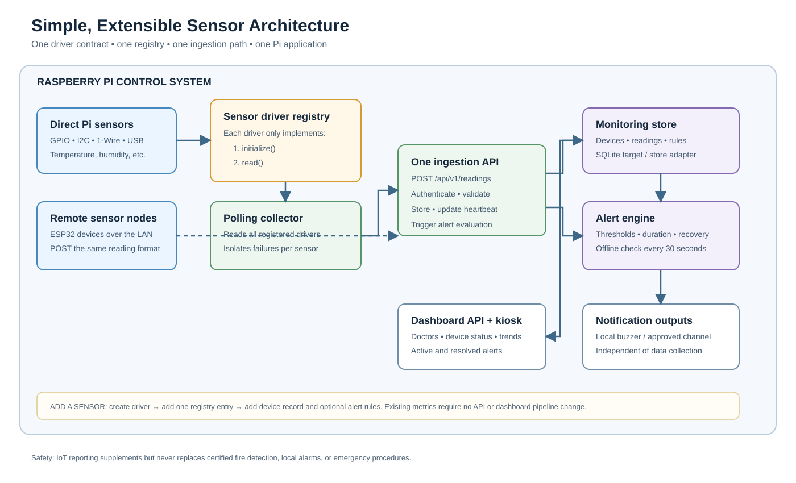

# Simple, Extensible Sensor Architecture

## Decision

Use one small sensor collector in the Raspberry Pi application. Every directly connected sensor is
wrapped by the same two-operation driver interface and listed in one registry. The collector polls
all registered drivers and sends their readings through the existing ingestion API. Remote ESP32
nodes continue to use that same API.

This keeps construction simple: one Pi application, one API contract, one storage path, and no
message broker or sensor-specific API routes. A failure in one sensor is logged and does not stop
the other sensors.



## The only sensor-specific contract

```text
SensorDriver {
    id                 // unique driver instance, e.g. "pharmacy_sht40"
    deviceCode         // existing device record, e.g. "pharmacy_room"
    initialize()       // open GPIO / I2C / USB once at startup
    read(now)          // return zero or more { metric, value, unit, quality, recordedAt }
    close()            // optional cleanup at shutdown
}
```

The registry is an ordinary list, not a plug-in framework:

```text
SENSORS = [
    Ds18b20Driver(deviceCode="fridge_male_ward", bus="/sys/bus/w1/..."),
    Sht40Driver(deviceCode="male_ward", i2cBus=1, address="0x44"),
    NewSensorDriver(deviceCode="new_location", ...configuration)
]
```

## One-page pseudocode for the whole system

```text
CONSTANT SAMPLE_INTERVAL = configured value, normally 30-60 seconds
CONSTANT OFFLINE_CHECK_INTERVAL = 30 seconds

function MAIN():
    config = loadEnvironment()
    store = connectMonitoringStore(config)       // SQLite target; Supabase currently implemented
    api = startHttpApi(store)
    dashboard = serveStaticDashboard(api)
    sensors = SENSORS                            // one registry is the extension point
    readySensors = []

    for each sensor in sensors:
        try:
            sensor.initialize()                  // initialize once, not on every loop
            readySensors.add(sensor)
        catch error:
            log(sensor.id + " unavailable", error)

    startBackgroundTask every OFFLINE_CHECK_INTERVAL:
        store.evaluateOfflineAlerts(now())

    while applicationIsRunning:
        in parallel for each sensor in readySensors:
            try:
                readings = sensor.read(now())
                if readings is not empty:
                    INGEST({
                        contractVersion: 1,
                        deviceCode: sensor.deviceCode,
                        readings: readings
                    })
            catch error:
                log(sensor.id + " read failed", error)   // other sensors continue

        wait(SAMPLE_INTERVAL)

    for each sensor in readySensors:
        sensor.close()
    stopHttpApi(api)

function INGEST(batch):
    authenticateDeviceCredential()
    validatedBatch = validateMetricUnitValueAndTimestamp(batch)
    device = store.findDeviceByCode(validatedBatch.deviceCode)
    if device does not exist:
        reject("unknown deviceCode")

    store.saveReadingsAndUpdateHeartbeat(device, validatedBatch)
    store.evaluateDeviceAlerts(device, now())
    return accepted(readingCount)

// Remote ESP32 nodes call INGEST through POST /api/v1/readings.
// Direct Pi sensors call the same ingestion operation from the local collector.

while dashboardIsOpen:
    snapshot = GET /api/v1/dashboard
    renderDoctorsDevicesReadingsAlerts(snapshot)
    wait(DASHBOARD_REFRESH_INTERVAL)
```

## Adding another sensor

1. Select the logical device that owns the reading, or add a device record with a stable
   `deviceCode`, name, location, and existing type.
2. Write a small driver that implements `initialize()` and `read()`; add it to `SENSORS`.
3. Add configurable alert rules for the readings that need alerts, then run one valid, invalid, and
   disconnected-sensor test.

If the new sensor reports an existing metric such as temperature or humidity under an existing
device type, nothing else changes. A genuinely new metric or device type also needs one shared
contract/database-constraint update and a dashboard label or presentation rule. Fire detection must
remain an approved independent safety system; this application may report its reviewed relay/alarm
state but must not replace it.
